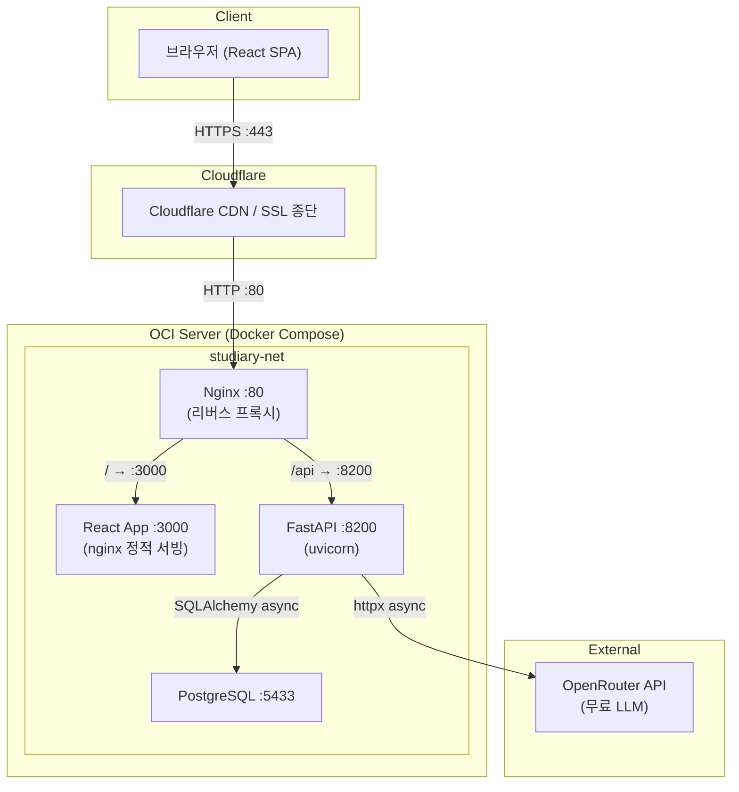
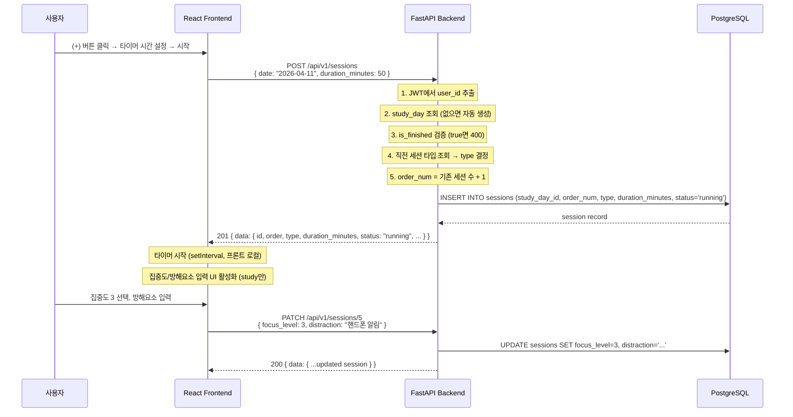
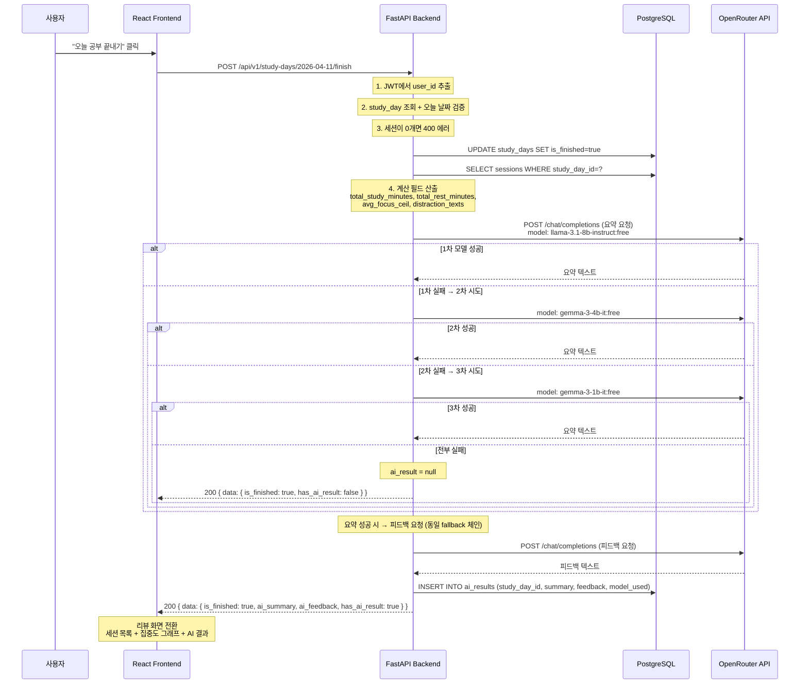

# 아키텍처 설계 문서 — Studiary

> 버전: 1.0 (확정본)
> 최종 업데이트: 2026-04-11
> 기반 문서: spec/02_architecture_preview.md

---

## 1. 프로젝트 개요

- **프로젝트명**: Studiary
- **설명**: 하루 공부 세션을 기록하고, 집중도/방해요소 데이터를 바탕으로 AI가 요약과 피드백을 생성하는 학습 세션 생산성 기록 서비스
- **타깃 사용자**: 공부를 기록하고 개선하고 싶은 학생, 수험생, 직장인
- **프로젝트 규모**: 소규모 (MVP)

---

## 2. 기능 요구사항

| # | 기능 | 설명 | 우선순위 |
|---|------|------|---------|
| FR-1 | 회원가입/로그인 | 이메일+비밀번호 기반 계정 생성 및 JWT 인증 | P0 |
| FR-2 | 메인 기록 화면 | 월별 히트맵 + 날짜별 공부 기록 카드 목록 | P0 |
| FR-3 | 공부 세션 생성 | 타이머 시간 설정 후 공부/휴식 세션 교대 생성 | P0 |
| FR-4 | 세션 진행 기록 | 타이머 진행 중 집중도(1~5) 및 방해요소(100자) 기록 | P0 |
| FR-5 | 세션 수정/삭제 | 당일+미종료 상태에서만 편집, 삭제 확인 알림 | P0 |
| FR-6 | 공부 종료 리뷰 | 세션 목록 + 집중도 변화 그래프 + AI 요약/피드백 | P0 |
| FR-7 | AI 요약 생성 | OpenRouter 무료 모델 3개 fallback 체인으로 하루 요약 | P0 |
| FR-8 | AI 피드백 생성 | 요약 텍스트 기반 개선 제안 피드백 | P0 |
| FR-9 | AI 재생성 | AI 실패 시 재생성 버튼, 성공 시 비활성화 | P0 |
| FR-10 | 과거 기록 조회 | 과거 날짜 카드 클릭 시 읽기 전용 기록 표시 | P0 |

## 3. 비기능 요구사항

| # | 항목 | 요구사항 |
|---|------|---------|
| NFR-1 | 성능 | API 응답 500ms 이내 (AI 호출 제외), 동시 접속 50명 이상 |
| NFR-2 | 보안 | JWT 인증, bcrypt 해싱, CORS 제한, 환경변수 관리 |
| NFR-3 | 가용성 | Docker Compose 단일 서버 배포, Nginx 리버스 프록시 |
| NFR-4 | 확장성 | 프론트/백 분리, AI 모델 교체 가능한 추상화 계층 |
| NFR-5 | 데이터 무결성 | AI 실패 시에도 세션 기록 반드시 저장 |
| NFR-6 | 접근성 | 반응형 웹 (모바일/데스크톱), 한국어 UI |

---

## 4. 기술 스택

| 구분 | 기술 | 선택 근거 |
|------|------|----------|
| 프론트엔드 | React 18+ (Vite 5) | SPA에 적합, 빠른 HMR, 사용자 지정 |
| 라우팅 | React Router v6 | SPA 라우팅 표준, 4개 페이지 규모에 적합 |
| 상태관리 | Zustand | 경량(~1KB), 보일러플레이트 최소, 사용자 지정 |
| HTTP 클라이언트 | Axios | 인터셉터 기반 JWT 자동 첨부, 요청/응답 변환 |
| 차트 | Recharts | React 네이티브 차트, 집중도 Line Chart에 적합, 경량 |
| CSS | Tailwind CSS 3 | 유틸리티 기반 빠른 UI 개발, 반응형 내장 |
| 백엔드 | FastAPI (Python 3.11) | 비동기 지원, OpenAPI 자동 생성, 사용자 지정 |
| ORM | SQLAlchemy 2.0 (async) | FastAPI 생태계 표준, async session 지원 |
| DB Migration | Alembic | SQLAlchemy 공식 마이그레이션, 사용자 지정 |
| DB | PostgreSQL 15+ | 안정적 RDBMS, CHECK/UNIQUE 제약 지원, 사용자 지정 |
| 인증 | JWT (python-jose + passlib[bcrypt]) | stateless, 다중 기기 접속 지원 |
| AI | OpenRouter API | 무료 모델 3개 fallback (llama-3.1-8b, gemma-3-4b, gemma-3-1b) |
| 웹서버 | Nginx (alpine) | 리버스 프록시, 정적 파일 서빙 |
| 컨테이너 | Docker + Docker Compose | 단일 compose 파일 배포 |
| 클라우드 | OCI (Oracle Cloud Infrastructure) | 사용자 지정 배포 환경 |
| HTTPS | Cloudflare | SSL 종단, Nginx는 HTTP(80)만 처리 |
| 설정 관리 | pydantic-settings | 환경변수 로드, 타입 검증 |

---

## 5. 시스템 구성도



---

## 6. 프론트엔드 디렉토리 구조

```
frontend/
├── index.html
├── package.json
├── vite.config.ts
├── tsconfig.json
├── tsconfig.node.json
├── tailwind.config.js
├── postcss.config.js
├── .env.example                    # VITE_API_BASE_URL
├── public/
│   └── favicon.ico
└── src/
    ├── main.tsx                    # ReactDOM.createRoot, BrowserRouter
    ├── App.tsx                     # 라우트 정의 (/, /login, /register, /study/:date)
    ├── api/
    │   ├── client.ts               # Axios 인스턴스 생성, baseURL, JWT 인터셉터
    │   ├── auth.ts                 # register(), login(), getMe()
    │   ├── sessions.ts             # createSession(), updateSession(), deleteSession()
    │   ├── studyDays.ts            # getStudyDays(), getStudyDay(), finishStudyDay(), regenerateAI()
    │   └── heatmap.ts              # getHeatmap()
    ├── stores/
    │   ├── authStore.ts            # token, user, login(), logout(), isAuthenticated
    │   ├── sessionStore.ts         # sessions[], currentTimer, addSession(), updateSession()
    │   └── studyDayStore.ts        # studyDays[], heatmapData, selectedDate
    ├── pages/
    │   ├── LoginPage.tsx           # 이메일/비밀번호 폼, 로그인 API 호출
    │   ├── RegisterPage.tsx        # 이메일/비밀번호/비밀번호확인/닉네임 폼
    │   ├── MainPage.tsx            # HeatmapGrid + StudyDayCardList 조합
    │   └── StudyPage.tsx           # 초기/진행/리뷰 3가지 상태 통합 페이지
    ├── components/
    │   ├── common/
    │   │   ├── Button.tsx          # 공통 버튼 (variant: primary/secondary/danger)
    │   │   ├── Input.tsx           # 공통 입력 필드 (label, error 포함)
    │   │   ├── Modal.tsx           # 공통 모달 (삭제 확인 등)
    │   │   ├── LoadingSpinner.tsx  # 로딩 인디케이터
    │   │   └── ErrorMessage.tsx    # 에러 메시지 표시
    │   ├── heatmap/
    │   │   ├── HeatmapGrid.tsx     # 월별 히트맵 그리드 (7열 x N행)
    │   │   ├── HeatmapCell.tsx     # 개별 셀 (색상 매핑, 클릭 이벤트)
    │   │   └── MonthSelector.tsx   # 년/월 선택기
    │   ├── study-day/
    │   │   ├── StudyDayCard.tsx    # 날짜별 기록 카드 (총 시간, AI 요약)
    │   │   └── StudyDayCardList.tsx # 카드 목록 (스크롤 영역)
    │   ├── session/
    │   │   ├── SessionCard.tsx     # 세션 카드 (공부=사각형, 휴식=원형)
    │   │   ├── SessionList.tsx     # 세션 목록 컨테이너
    │   │   ├── TimerSetup.tsx      # 타이머 시간 설정 (분 단위, 증감 버튼)
    │   │   ├── TimerDisplay.tsx    # 타이머 카운트다운 표시 + 일시정지/재생
    │   │   ├── FocusLevelInput.tsx # 집중도 1~5 선택 (라디오 버튼)
    │   │   ├── DistractionInput.tsx # 방해요소 텍스트 입력 (100자 제한)
    │   │   └── SessionMenu.tsx     # 세션 더보기 메뉴 (수정/삭제)
    │   ├── review/
    │   │   ├── FocusChart.tsx      # 집중도 변화 Line Chart (Recharts)
    │   │   ├── AISummary.tsx       # AI 요약 텍스트 표시
    │   │   ├── AIFeedback.tsx      # AI 피드백 텍스트 표시
    │   │   └── RegenerateButton.tsx # AI 재생성 버튼 (로딩 상태 포함)
    │   └── layout/
    │       ├── Header.tsx          # 상단바 (로고, 닉네임, 로그아웃)
    │       └── ProtectedRoute.tsx  # 인증 가드 (미인증 시 /login 리다이렉트)
    ├── hooks/
    │   ├── useTimer.ts             # 타이머 커스텀 훅 (start, pause, resume, reset)
    │   └── useAuth.ts              # 인증 상태 확인 + 자동 로그아웃
    ├── utils/
    │   ├── date.ts                 # 날짜 포맷팅 (YYYY-MM-DD, 시:분 등)
    │   ├── focus.ts                # 집중도 색상 매핑, 평균 올림 계산
    │   └── constants.ts            # 히트맵 색상값, 타이머 기본값 등 상수
    └── types/
        ├── auth.ts                 # User, LoginRequest, RegisterRequest
        ├── session.ts              # Session, CreateSessionRequest, UpdateSessionRequest
        ├── studyDay.ts             # StudyDay, StudyDayDetail, HeatmapDay
        └── ai.ts                   # AIResult, RegenerateResponse
```

---

## 7. 백엔드 디렉토리 구조

```
backend/
├── requirements.txt                # 의존성 목록
├── Dockerfile
├── alembic.ini                     # Alembic 설정 (sqlalchemy.url은 env.py에서 동적 로드)
├── .env.example                    # 환경변수 예시
├── alembic/
│   ├── env.py                      # Alembic 환경 설정 (async 엔진)
│   ├── script.py.mako              # 마이그레이션 템플릿
│   └── versions/
│       └── 001_initial_schema.py   # 초기 테이블 4개 + 인덱스 생성
└── app/
    ├── __init__.py
    ├── main.py                     # FastAPI 앱 생성, 라우터 등록, CORS 설정, lifespan
    ├── config.py                   # pydantic-settings BaseSettings (환경변수 로드)
    ├── database.py                 # AsyncEngine, async_sessionmaker, get_db 의존성
    ├── models/
    │   ├── __init__.py             # Base 선언 + 모든 모델 import
    │   ├── user.py                 # User 모델
    │   ├── study_day.py            # StudyDay 모델
    │   ├── session.py              # Session 모델
    │   └── ai_result.py            # AIResult 모델
    ├── schemas/
    │   ├── __init__.py
    │   ├── auth.py                 # RegisterRequest, LoginRequest, UserResponse, TokenResponse
    │   ├── session.py              # SessionCreate, SessionUpdate, SessionResponse
    │   ├── study_day.py            # StudyDayListItem, StudyDayDetail, FinishResponse
    │   ├── ai_result.py            # AIResultResponse, RegenerateResponse
    │   └── common.py               # APIResponse[T] 공통 래퍼, ErrorResponse
    ├── routers/
    │   ├── __init__.py
    │   ├── auth.py                 # POST /auth/register, POST /auth/login, GET /auth/me
    │   ├── sessions.py             # POST /sessions, PATCH /sessions/{id}, DELETE /sessions/{id}
    │   ├── study_days.py           # GET /study-days, GET /study-days/{date}, POST /study-days/{date}/finish, POST /study-days/{date}/regenerate-ai
    │   └── heatmap.py              # GET /heatmap
    ├── services/
    │   ├── __init__.py
    │   ├── auth_service.py         # 회원가입, 로그인, 사용자 조회
    │   ├── session_service.py      # 세션 CRUD, 타입 자동결정, 당일+미종료 검증
    │   ├── study_day_service.py    # 학습일 조회, 종료 처리, 계산 필드 생성
    │   └── ai_service.py           # AI 요약/피드백 생성, fallback 체인 실행
    ├── dependencies.py             # get_current_user (JWT 검증), get_db (세션 의존성)
    └── utils/
        ├── __init__.py
        ├── security.py             # hash_password, verify_password, create_access_token, decode_token
        └── ai_client.py            # OpenRouterClient 클래스 (httpx async, fallback 로직)
```

---

## 8. 데이터 흐름도

### 8.1 세션 생성 흐름



### 8.2 공부 종료 + AI 생성 흐름



---

## 9. 배포 아키텍처

### 9.1 Docker Compose 서비스 구성

| 서비스 | 이미지 | 포트 (내부) | 포트 (외부) | 역할 |
|--------|--------|------------|------------|------|
| nginx | nginx:alpine | 80 | 80 | 리버스 프록시, 트래픽 라우팅 |
| frontend | node:20-alpine (빌드) → nginx:alpine (서빙) | 3000 | - | React SPA 정적 파일 서빙 |
| backend | python:3.11-slim | 8200 | - | FastAPI 서버 (uvicorn) |
| db | postgres:15-alpine | 5432→5433 | - | PostgreSQL 데이터베이스 |

### 9.2 Docker Compose 파일 구조

```yaml
# docker-compose.yml (구조 예시)
version: "3.8"

services:
  nginx:
    image: nginx:alpine
    ports:
      - "80:80"
    volumes:
      - ./nginx/nginx.conf:/etc/nginx/nginx.conf:ro
    depends_on:
      - frontend
      - backend
    networks:
      - studiary-net

  frontend:
    build:
      context: ./frontend
      dockerfile: Dockerfile
    expose:
      - "3000"
    networks:
      - studiary-net

  backend:
    build:
      context: ./backend
      dockerfile: Dockerfile
    expose:
      - "8200"
    env_file:
      - .env
    depends_on:
      db:
        condition: service_healthy
    command: >
      sh -c "alembic upgrade head && uvicorn app.main:app --host 0.0.0.0 --port 8200"
    networks:
      - studiary-net

  db:
    image: postgres:15-alpine
    environment:
      POSTGRES_USER: ${POSTGRES_USER}
      POSTGRES_PASSWORD: ${POSTGRES_PASSWORD}
      POSTGRES_DB: ${POSTGRES_DB}
    ports:
      - "5433:5432"
    volumes:
      - pgdata:/var/lib/postgresql/data
    healthcheck:
      test: ["CMD-SHELL", "pg_isready -U ${POSTGRES_USER}"]
      interval: 5s
      timeout: 5s
      retries: 5
    networks:
      - studiary-net

volumes:
  pgdata:

networks:
  studiary-net:
    driver: bridge
```

### 9.3 Nginx 설정

```nginx
# nginx/nginx.conf
events {
    worker_connections 1024;
}

http {
    upstream frontend {
        server frontend:3000;
    }

    upstream backend {
        server backend:8200;
    }

    server {
        listen 80;
        server_name _;

        # API 요청 → 백엔드
        location /api/ {
            proxy_pass http://backend;
            proxy_set_header Host $host;
            proxy_set_header X-Real-IP $remote_addr;
            proxy_set_header X-Forwarded-For $proxy_add_x_forwarded_for;
            proxy_set_header X-Forwarded-Proto $scheme;
        }

        # 나머지 → 프론트엔드
        location / {
            proxy_pass http://frontend;
            proxy_set_header Host $host;
            proxy_set_header X-Real-IP $remote_addr;
        }
    }
}
```

### 9.4 환경변수 목록

| 변수 | 서비스 | 필수 | 설명 | 예시 |
|------|--------|------|------|------|
| `DATABASE_URL` | backend | O | PostgreSQL async 접속 URL | `postgresql+asyncpg://user:pass@db:5432/studiary` |
| `JWT_SECRET_KEY` | backend | O | JWT 서명 키 (최소 32자 랜덤) | `your-secret-key-min-32-chars` |
| `JWT_ALGORITHM` | backend | O | JWT 알고리즘 | `HS256` |
| `ACCESS_TOKEN_EXPIRE_MINUTES` | backend | O | 토큰 만료 시간 (분) | `1440` (24시간) |
| `OPENROUTER_API_KEY` | backend | O | OpenRouter API 키 | `sk-or-v1-...` |
| `OPENROUTER_BASE_URL` | backend | X | OpenRouter 엔드포인트 | `https://openrouter.ai/api/v1` |
| `POSTGRES_USER` | db | O | DB 사용자 | `studiary` |
| `POSTGRES_PASSWORD` | db | O | DB 비밀번호 | `secure-password` |
| `POSTGRES_DB` | db | O | DB 이름 | `studiary` |
| `CORS_ORIGINS` | backend | X | CORS 허용 도메인 (쉼표 구분) | `https://studiary.example.com` |

### 9.5 Frontend Dockerfile (멀티스테이지)

```dockerfile
# frontend/Dockerfile
FROM node:20-alpine AS build
WORKDIR /app
COPY package.json package-lock.json ./
RUN npm ci
COPY . .
RUN npm run build

FROM nginx:alpine
COPY --from=build /app/dist /usr/share/nginx/html
COPY nginx.conf /etc/nginx/conf.d/default.conf
EXPOSE 3000
```

Frontend 내부 nginx.conf:
```nginx
server {
    listen 3000;
    root /usr/share/nginx/html;
    index index.html;

    location / {
        try_files $uri $uri/ /index.html;
    }
}
```

### 9.6 Backend Dockerfile

```dockerfile
# backend/Dockerfile
FROM python:3.11-slim
WORKDIR /app

RUN apt-get update && apt-get install -y --no-install-recommends gcc libpq-dev \
    && rm -rf /var/lib/apt/lists/*

COPY requirements.txt .
RUN pip install --no-cache-dir -r requirements.txt

COPY . .

EXPOSE 8200
CMD ["sh", "-c", "alembic upgrade head && uvicorn app.main:app --host 0.0.0.0 --port 8200"]
```

---

## 10. 프론트엔드 전달 사항

- **프레임워크**: React 18 + Vite 5 + TypeScript
- **라우팅**: React Router v6, 4개 페이지 (`/login`, `/register`, `/`, `/study/:date`)
- **상태관리**: Zustand 3개 스토어 (auth, session, studyDay)
- **JWT 관리**: localStorage 저장, Axios 인터셉터에서 자동 첨부, 401 수신 시 자동 로그아웃
- **타이머**: 프론트 로컬 setInterval (서버에는 세션 생성/수정만 전달)
- **히트맵**: CSS Grid 기반 커스텀 구현 (7열 x N행), 색상은 `constants.ts`에 정의
- **세션 카드 시각 구분**: 공부=사각형(border-radius: 0), 휴식=원형(border-radius: 50%)
- **반응형**: Tailwind 브레이크포인트 활용 (sm:640px, md:768px, lg:1024px)
- **API Base URL**: 환경변수 `VITE_API_BASE_URL` (기본: `/api/v1`)

## 11. 백엔드 전달 사항

- **프레임워크**: FastAPI + uvicorn, Python 3.11
- **모든 API**: `/api/v1/` 접두사
- **DB**: SQLAlchemy 2.0 async, asyncpg 드라이버
- **인증**: python-jose로 JWT 생성/검증, passlib[bcrypt]로 비밀번호 해싱
- **AI 호출**: httpx AsyncClient, 3개 모델 순차 시도, 모두 실패 시 에러 삼킴 (ai_result null)
- **CORS**: `CORS_ORIGINS` 환경변수로 허용 도메인 제어
- **에러 핸들링**: HTTPException 기반, 공통 에러 형식 준수
- **비즈니스 규칙**: 세션 타입 자동결정, 당일+미종료만 수정 가능, 계산 필드는 DB 비저장

## 12. QA 전달 사항

- 핵심 테스트 시나리오: 회원가입→로그인→세션 생성→기록→종료→AI 리뷰 전체 흐름
- AI fallback 체인 각 모델 실패 케이스 검증
- 당일 이후 세션 수정/삭제 불가 검증
- 타이머 정확도 (브라우저 탭 비활성 시 오차 확인)
- 히트맵 색상 매핑 정합성

## 13. DevOps 전달 사항

- Docker Compose 단일 파일 배포
- Nginx 설정 파일 포함 (리버스 프록시)
- `.env.example` 제공, `.env`는 `.gitignore`에 등록
- Alembic 마이그레이션은 backend 컨테이너 시작 시 `alembic upgrade head` 자동 실행
- PostgreSQL healthcheck 설정으로 backend 시작 순서 보장
- DB 볼륨 `pgdata`로 데이터 영속성 확보
