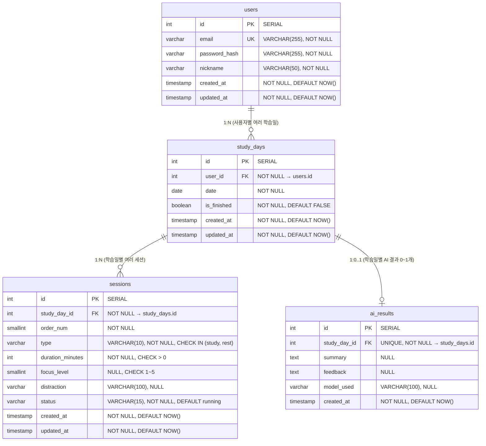

# DB 스키마 — Studiary

> 버전: 1.0 (확정본)
> 최종 업데이트: 2026-04-11
> 기반 문서: spec/04_db_preview.md

---

## 1. ERD



---

## 2. 테이블 상세 정의

### 2.1 users — 사용자 계정

| 컬럼 | 타입 | 제약조건 | 기본값 | 설명 |
|------|------|---------|--------|------|
| `id` | `SERIAL` | `PRIMARY KEY` | auto | 사용자 고유 ID |
| `email` | `VARCHAR(255)` | `UNIQUE`, `NOT NULL` | - | 로그인 이메일 (RFC 5322 형식) |
| `password_hash` | `VARCHAR(255)` | `NOT NULL` | - | bcrypt 해시 비밀번호 (`$2b$12$...`) |
| `nickname` | `VARCHAR(50)` | `NOT NULL` | - | 표시 이름 (1~50자) |
| `created_at` | `TIMESTAMP WITH TIME ZONE` | `NOT NULL` | `NOW()` | 가입일시 (UTC) |
| `updated_at` | `TIMESTAMP WITH TIME ZONE` | `NOT NULL` | `NOW()` | 최종 수정일시 (UTC) |

**SQLAlchemy 모델**:
```python
class User(Base):
    __tablename__ = "users"

    id = Column(Integer, primary_key=True, autoincrement=True)
    email = Column(String(255), unique=True, nullable=False, index=True)
    password_hash = Column(String(255), nullable=False)
    nickname = Column(String(50), nullable=False)
    created_at = Column(DateTime(timezone=True), nullable=False, server_default=func.now())
    updated_at = Column(DateTime(timezone=True), nullable=False, server_default=func.now(), onupdate=func.now())

    study_days = relationship("StudyDay", back_populates="user", cascade="all, delete-orphan")
```

---

### 2.2 study_days — 일별 학습 기록

| 컬럼 | 타입 | 제약조건 | 기본값 | 설명 |
|------|------|---------|--------|------|
| `id` | `SERIAL` | `PRIMARY KEY` | auto | 학습일 고유 ID |
| `user_id` | `INTEGER` | `FK → users.id`, `NOT NULL` | - | 소속 사용자 |
| `date` | `DATE` | `NOT NULL` | - | 학습 날짜 |
| `is_finished` | `BOOLEAN` | `NOT NULL` | `FALSE` | 공부 종료 여부 |
| `created_at` | `TIMESTAMP WITH TIME ZONE` | `NOT NULL` | `NOW()` | 생성일시 |
| `updated_at` | `TIMESTAMP WITH TIME ZONE` | `NOT NULL` | `NOW()` | 수정일시 |

**복합 유니크 제약**: `UNIQUE(user_id, date)` — 사용자별 날짜당 하나의 레코드만 허용

**SQLAlchemy 모델**:
```python
class StudyDay(Base):
    __tablename__ = "study_days"
    __table_args__ = (
        UniqueConstraint("user_id", "date", name="uq_study_days_user_date"),
    )

    id = Column(Integer, primary_key=True, autoincrement=True)
    user_id = Column(Integer, ForeignKey("users.id", ondelete="CASCADE"), nullable=False)
    date = Column(Date, nullable=False)
    is_finished = Column(Boolean, nullable=False, default=False)
    created_at = Column(DateTime(timezone=True), nullable=False, server_default=func.now())
    updated_at = Column(DateTime(timezone=True), nullable=False, server_default=func.now(), onupdate=func.now())

    user = relationship("User", back_populates="study_days")
    sessions = relationship("Session", back_populates="study_day", cascade="all, delete-orphan", order_by="Session.order_num")
    ai_result = relationship("AIResult", back_populates="study_day", uselist=False, cascade="all, delete-orphan")
```

---

### 2.3 sessions — 개별 공부/휴식 세션

| 컬럼 | 타입 | 제약조건 | 기본값 | 설명 |
|------|------|---------|--------|------|
| `id` | `SERIAL` | `PRIMARY KEY` | auto | 세션 고유 ID |
| `study_day_id` | `INTEGER` | `FK → study_days.id`, `NOT NULL` | - | 소속 학습일 |
| `order_num` | `SMALLINT` | `NOT NULL` | - | 세션 순서 (1부터) |
| `type` | `VARCHAR(10)` | `NOT NULL`, `CHECK IN ('study', 'rest')` | - | 세션 유형 |
| `duration_minutes` | `INTEGER` | `NOT NULL`, `CHECK (> 0)` | - | 설정 시간 (분 단위) |
| `focus_level` | `SMALLINT` | `NULL`, `CHECK (1~5)` | `NULL` | 집중도 (study 세션만, rest는 항상 NULL) |
| `distraction` | `VARCHAR(100)` | `NULL` | `NULL` | 방해요소 (study 세션만, 100자 제한) |
| `status` | `VARCHAR(15)` | `NOT NULL`, `CHECK IN ('running', 'paused', 'completed')` | `'running'` | 세션 상태 |
| `created_at` | `TIMESTAMP WITH TIME ZONE` | `NOT NULL` | `NOW()` | 생성일시 |
| `updated_at` | `TIMESTAMP WITH TIME ZONE` | `NOT NULL` | `NOW()` | 수정일시 |

**복합 유니크 제약**: `UNIQUE(study_day_id, order_num)` — 학습일 내 세션 순서 유일성

**SQLAlchemy 모델**:
```python
class Session(Base):
    __tablename__ = "sessions"
    __table_args__ = (
        UniqueConstraint("study_day_id", "order_num", name="uq_sessions_order"),
        CheckConstraint("type IN ('study', 'rest')", name="ck_sessions_type"),
        CheckConstraint("duration_minutes > 0", name="ck_sessions_duration_positive"),
        CheckConstraint("focus_level IS NULL OR (focus_level >= 1 AND focus_level <= 5)", name="ck_sessions_focus_range"),
        CheckConstraint("status IN ('running', 'paused', 'completed')", name="ck_sessions_status"),
    )

    id = Column(Integer, primary_key=True, autoincrement=True)
    study_day_id = Column(Integer, ForeignKey("study_days.id", ondelete="CASCADE"), nullable=False)
    order_num = Column(SmallInteger, nullable=False)
    type = Column(String(10), nullable=False)
    duration_minutes = Column(Integer, nullable=False)
    focus_level = Column(SmallInteger, nullable=True)
    distraction = Column(String(100), nullable=True)
    status = Column(String(15), nullable=False, default="running")
    created_at = Column(DateTime(timezone=True), nullable=False, server_default=func.now())
    updated_at = Column(DateTime(timezone=True), nullable=False, server_default=func.now(), onupdate=func.now())

    study_day = relationship("StudyDay", back_populates="sessions")
```

---

### 2.4 ai_results — AI 요약/피드백 결과

| 컬럼 | 타입 | 제약조건 | 기본값 | 설명 |
|------|------|---------|--------|------|
| `id` | `SERIAL` | `PRIMARY KEY` | auto | AI 결과 고유 ID |
| `study_day_id` | `INTEGER` | `FK → study_days.id`, `UNIQUE`, `NOT NULL` | - | 소속 학습일 (1:1) |
| `summary` | `TEXT` | `NULL` | `NULL` | AI 생성 요약 (1~2문장) |
| `feedback` | `TEXT` | `NULL` | `NULL` | AI 생성 피드백 (1~2문장) |
| `model_used` | `VARCHAR(100)` | `NULL` | `NULL` | 사용된 AI 모델명 |
| `created_at` | `TIMESTAMP WITH TIME ZONE` | `NOT NULL` | `NOW()` | 생성일시 |

**1:1 관계**: `study_day_id`에 UNIQUE 제약으로 학습일당 최대 1개 AI 결과

**SQLAlchemy 모델**:
```python
class AIResult(Base):
    __tablename__ = "ai_results"

    id = Column(Integer, primary_key=True, autoincrement=True)
    study_day_id = Column(Integer, ForeignKey("study_days.id", ondelete="CASCADE"), unique=True, nullable=False)
    summary = Column(Text, nullable=True)
    feedback = Column(Text, nullable=True)
    model_used = Column(String(100), nullable=True)
    created_at = Column(DateTime(timezone=True), nullable=False, server_default=func.now())

    study_day = relationship("StudyDay", back_populates="ai_result")
```

---

## 3. 관계 요약

| 관계 | 타입 | FK | CASCADE | 설명 |
|------|------|----|---------| ------|
| users → study_days | 1:N | `study_days.user_id → users.id` | DELETE CASCADE | 사용자 삭제 시 학습일도 삭제 |
| study_days → sessions | 1:N | `sessions.study_day_id → study_days.id` | DELETE CASCADE | 학습일 삭제 시 세션도 삭제 |
| study_days → ai_results | 1:0..1 | `ai_results.study_day_id → study_days.id` | DELETE CASCADE | 학습일 삭제 시 AI 결과도 삭제 |

---

## 4. 인덱스 전략

| 테이블 | 인덱스명 | 컬럼 | 타입 | 용도 |
|--------|---------|------|------|------|
| `users` | `uq_users_email` | `email` | UNIQUE | 이메일 중복 방지 + 로그인 조회 |
| `study_days` | `uq_study_days_user_date` | `(user_id, date)` | UNIQUE COMPOSITE | 사용자별 날짜 유일성 + 특정 날짜 조회 |
| `study_days` | `ix_study_days_user_id` | `user_id` | INDEX | 사용자별 학습일 목록 조회 |
| `study_days` | `ix_study_days_date` | `date` | INDEX | 날짜 범위 조회 (히트맵 월별 조회) |
| `sessions` | `ix_sessions_study_day_id` | `study_day_id` | INDEX | 학습일별 세션 목록 조회 |
| `sessions` | `uq_sessions_order` | `(study_day_id, order_num)` | UNIQUE COMPOSITE | 세션 순서 유일성 보장 |
| `ai_results` | `uq_ai_results_study_day` | `study_day_id` | UNIQUE | 학습일당 1개 AI 결과 보장 |

**인덱스 근거**:
- `uq_study_days_user_date`: `GET /study-days/{date}`, `POST /sessions` 등에서 `(user_id, date)` 조건 조회가 빈번
- `ix_study_days_date`: `GET /heatmap?year&month`에서 날짜 범위 조건 (`date BETWEEN ? AND ?`)
- `ix_sessions_study_day_id`: `GET /study-days/{date}` 상세 조회 시 세션 목록 로드

---

## 5. 계산 필드 정의

아래 값들은 DB에 컬럼으로 저장하지 않고, API 응답 시 세션 데이터에서 실시간 계산한다.

| 필드 | 계산 방식 | SQL 표현 | 사용 API |
|------|----------|---------|----------|
| `total_study_minutes` | study 세션의 duration 합 | `SUM(duration_minutes) WHERE type='study'` | study-days 목록/상세 |
| `total_rest_minutes` | rest 세션의 duration 합 | `SUM(duration_minutes) WHERE type='rest'` | study-days 목록/상세 |
| `avg_focus_ceil` | study 세션 집중도 평균 올림 | `CEIL(AVG(focus_level)) WHERE type='study' AND focus_level IS NOT NULL` | study-days 목록/상세, heatmap |
| `has_ai_result` | ai_results 레코드 존재 여부 | `EXISTS (SELECT 1 FROM ai_results WHERE study_day_id=?)` | study-days 목록/상세 |

**엣지 케이스 처리**:
- study 세션이 0개 → `total_study_minutes = 0`, `avg_focus_ceil = 0`
- study 세션이 있지만 focus_level이 전부 NULL → `avg_focus_ceil = 0`
- rest 세션이 0개 → `total_rest_minutes = 0`

**서비스 레이어 구현 예시** (Python):
```python
def calculate_study_day_stats(sessions: list[Session]) -> dict:
    study_sessions = [s for s in sessions if s.type == "study"]
    rest_sessions = [s for s in sessions if s.type == "rest"]

    total_study = sum(s.duration_minutes for s in study_sessions)
    total_rest = sum(s.duration_minutes for s in rest_sessions)

    focus_values = [s.focus_level for s in study_sessions if s.focus_level is not None]
    avg_focus_ceil = math.ceil(sum(focus_values) / len(focus_values)) if focus_values else 0

    return {
        "total_study_minutes": total_study,
        "total_rest_minutes": total_rest,
        "avg_focus_ceil": avg_focus_ceil,
    }
```

---

## 6. 마이그레이션 전략

### 6.1 Alembic 설정

- `alembic.ini`: 프로젝트 루트의 `backend/alembic.ini`에 위치
- `sqlalchemy.url`은 `alembic/env.py`에서 `app.config`를 통해 동적 로드 (`.env` 기반)
- async 엔진 사용: `asyncpg` 드라이버

### 6.2 마이그레이션 실행

```bash
# 로컬 개발
cd backend
alembic upgrade head          # 최신 상태로 마이그레이션
alembic revision --autogenerate -m "설명"  # 새 마이그레이션 생성
alembic downgrade -1          # 1단계 롤백

# Docker 배포 (자동)
# docker-compose.yml의 backend command에서 자동 실행:
# sh -c "alembic upgrade head && uvicorn app.main:app --host 0.0.0.0 --port 8200"
```

### 6.3 초기 마이그레이션 (001_initial_schema.py)

4개 테이블 + 인덱스를 일괄 생성하는 첫 번째 마이그레이션.

---

## 7. 초기 마이그레이션 SQL 예시

```sql
-- 001_initial_schema (Alembic upgrade)

-- 1. users 테이블
CREATE TABLE users (
    id SERIAL PRIMARY KEY,
    email VARCHAR(255) NOT NULL,
    password_hash VARCHAR(255) NOT NULL,
    nickname VARCHAR(50) NOT NULL,
    created_at TIMESTAMP WITH TIME ZONE NOT NULL DEFAULT NOW(),
    updated_at TIMESTAMP WITH TIME ZONE NOT NULL DEFAULT NOW(),
    CONSTRAINT uq_users_email UNIQUE (email)
);

-- 2. study_days 테이블
CREATE TABLE study_days (
    id SERIAL PRIMARY KEY,
    user_id INTEGER NOT NULL,
    date DATE NOT NULL,
    is_finished BOOLEAN NOT NULL DEFAULT FALSE,
    created_at TIMESTAMP WITH TIME ZONE NOT NULL DEFAULT NOW(),
    updated_at TIMESTAMP WITH TIME ZONE NOT NULL DEFAULT NOW(),
    CONSTRAINT fk_study_days_user FOREIGN KEY (user_id) REFERENCES users (id) ON DELETE CASCADE,
    CONSTRAINT uq_study_days_user_date UNIQUE (user_id, date)
);

CREATE INDEX ix_study_days_user_id ON study_days (user_id);
CREATE INDEX ix_study_days_date ON study_days (date);

-- 3. sessions 테이블
CREATE TABLE sessions (
    id SERIAL PRIMARY KEY,
    study_day_id INTEGER NOT NULL,
    order_num SMALLINT NOT NULL,
    type VARCHAR(10) NOT NULL,
    duration_minutes INTEGER NOT NULL,
    focus_level SMALLINT,
    distraction VARCHAR(100),
    status VARCHAR(15) NOT NULL DEFAULT 'running',
    created_at TIMESTAMP WITH TIME ZONE NOT NULL DEFAULT NOW(),
    updated_at TIMESTAMP WITH TIME ZONE NOT NULL DEFAULT NOW(),
    CONSTRAINT fk_sessions_study_day FOREIGN KEY (study_day_id) REFERENCES study_days (id) ON DELETE CASCADE,
    CONSTRAINT uq_sessions_order UNIQUE (study_day_id, order_num),
    CONSTRAINT ck_sessions_type CHECK (type IN ('study', 'rest')),
    CONSTRAINT ck_sessions_duration_positive CHECK (duration_minutes > 0),
    CONSTRAINT ck_sessions_focus_range CHECK (focus_level IS NULL OR (focus_level >= 1 AND focus_level <= 5)),
    CONSTRAINT ck_sessions_status CHECK (status IN ('running', 'paused', 'completed'))
);

CREATE INDEX ix_sessions_study_day_id ON sessions (study_day_id);

-- 4. ai_results 테이블
CREATE TABLE ai_results (
    id SERIAL PRIMARY KEY,
    study_day_id INTEGER NOT NULL,
    summary TEXT,
    feedback TEXT,
    model_used VARCHAR(100),
    created_at TIMESTAMP WITH TIME ZONE NOT NULL DEFAULT NOW(),
    CONSTRAINT fk_ai_results_study_day FOREIGN KEY (study_day_id) REFERENCES study_days (id) ON DELETE CASCADE,
    CONSTRAINT uq_ai_results_study_day UNIQUE (study_day_id)
);
```

```sql
-- 001_initial_schema (Alembic downgrade)
DROP TABLE IF EXISTS ai_results;
DROP TABLE IF EXISTS sessions;
DROP TABLE IF EXISTS study_days;
DROP TABLE IF EXISTS users;
```

---

## 8. 데이터 무결성 규칙

### 8.1 DB 레벨 제약 (CHECK/UNIQUE/FK)

| 규칙 | 제약 타입 | 대상 |
|------|----------|------|
| 이메일 유일성 | UNIQUE | `users.email` |
| 사용자별 날짜당 1개 학습일 | UNIQUE COMPOSITE | `study_days(user_id, date)` |
| 학습일별 세션 순서 유일성 | UNIQUE COMPOSITE | `sessions(study_day_id, order_num)` |
| 학습일당 1개 AI 결과 | UNIQUE | `ai_results.study_day_id` |
| 세션 타입 제한 | CHECK | `sessions.type IN ('study', 'rest')` |
| 세션 시간 양수 | CHECK | `sessions.duration_minutes > 0` |
| 집중도 범위 | CHECK | `sessions.focus_level IS NULL OR (1~5)` |
| 세션 상태 제한 | CHECK | `sessions.status IN ('running', 'paused', 'completed')` |
| CASCADE 삭제 | FK ON DELETE CASCADE | users→study_days→sessions/ai_results |

### 8.2 애플리케이션 레벨 검증

| 규칙 | 검증 위치 | 설명 |
|------|----------|------|
| 휴식 세션에 집중도/방해요소 불가 | `session_service.py` | `type='rest'`인 세션에 focus_level/distraction 설정 시 400 에러 |
| 종료된 학습일 세션 수정/삭제 불가 | `session_service.py` | `is_finished=true`인 study_day의 세션 변경 시 400 에러 |
| AI 결과는 종료된 학습일에만 생성 | `ai_service.py` | `is_finished=true`인 경우에만 ai_results INSERT |
| 세션 삭제 시 order_num 재정렬 | `session_service.py` | DELETE 후 남은 세션의 order_num을 1부터 순차 재할당 |
| 세션 생성은 당일만 | `session_service.py` | date가 오늘 날짜가 아니면 400 에러 |
| 공부 종료는 세션 1개 이상 필요 | `study_day_service.py` | 세션 0개인 학습일에 finish 시도 시 400 에러 |
| AI 재생성은 기존 결과 없을 때만 | `ai_service.py` | ai_results 레코드 존재 시 재생성 거부 (400) |

### 8.3 타임존 규칙

- 모든 `TIMESTAMP` 컬럼은 `WITH TIME ZONE` 사용
- 서버 측에서는 UTC 기준 저장
- `date` 컬럼은 타임존 없는 DATE 타입 (사용자 로컬 날짜 기준)
- 프론트엔드에서 날짜 전송 시 `YYYY-MM-DD` 형식 (타임존 없음)
- "오늘 날짜" 판단: 서버 시간 기준 UTC date (추후 사용자 타임존 설정 도입 가능)
