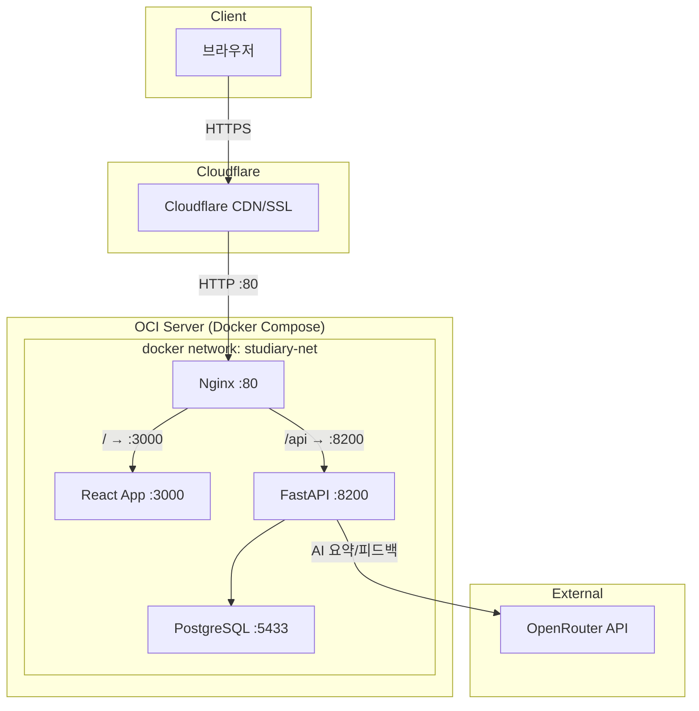
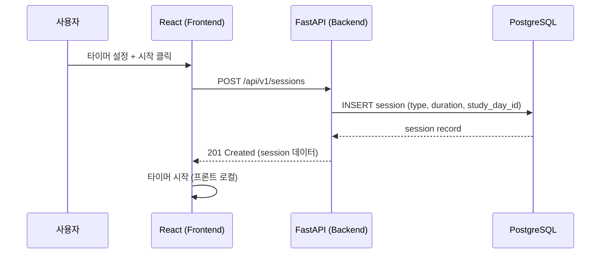
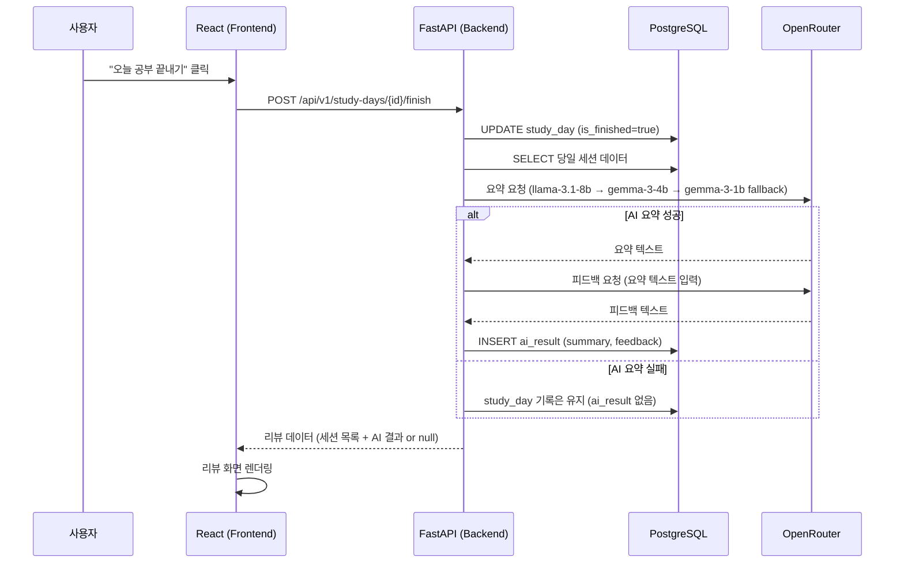

# 아키텍처 초안 — Studiary

> 버전: 0.1 (spec 초안)
> 최종 업데이트: 2026-04-11

---

## 1. 기술 스택

| 구분 | 기술 | 선택 근거 |
|------|------|----------|
| 프론트엔드 | React 18+ (Vite) | 사용자 지정, SPA 구조에 적합 |
| 상태관리 | Zustand | 사용자 지정, 경량 상태관리 |
| HTTP 클라이언트 | Axios | 인터셉터 기반 JWT 자동 첨부, 에러 핸들링 |
| 차트 | Recharts 또는 Chart.js | 집중도 변화 그래프용 경량 차트 라이브러리 |
| CSS | Tailwind CSS | 빠른 UI 개발, 반응형 지원 |
| 백엔드 | FastAPI (Python) | 사용자 지정, 비동기 지원, OpenAPI 자동 생성 |
| ORM | SQLAlchemy 2.0 | FastAPI 생태계 표준, async 지원 |
| DB Migration | Alembic | 사용자 지정, SQLAlchemy 공식 마이그레이션 도구 |
| DB | PostgreSQL 15+ | 사용자 지정, 안정적 RDBMS |
| 인증 | JWT (python-jose + passlib[bcrypt]) | 다중 기기 접속, stateless 인증 |
| AI | OpenRouter API | 무료 모델 3개 fallback 체인 |
| 웹서버 | Nginx | 리버스 프록시, 정적 파일 서빙 |
| 컨테이너 | Docker + Docker Compose | 단일 compose 파일로 전체 스택 배포 |
| 클라우드 | OCI (Oracle Cloud Infrastructure) | 사용자 지정 배포 환경 |
| HTTPS | Cloudflare | SSL 종단, Nginx는 HTTP만 처리 |

---

## 2. 시스템 구성도



---

## 3. 컴포넌트 구조

### 3.1 프론트엔드 컴포넌트 계층

```
src/
├── main.tsx
├── App.tsx
├── api/                     # Axios 인스턴스, API 호출 함수
│   ├── client.ts            # Axios 설정, JWT 인터셉터
│   ├── auth.ts              # 로그인/회원가입 API
│   ├── sessions.ts          # 세션 CRUD API
│   ├── studyDays.ts         # 일별 기록 조회 API
│   └── ai.ts                # AI 재생성 API
├── stores/                  # Zustand 스토어
│   ├── authStore.ts         # 인증 상태 (토큰, 유저 정보)
│   ├── sessionStore.ts      # 현재 세션 상태 (타이머, 세션 목록)
│   └── studyDayStore.ts     # 메인 화면 데이터 (히트맵, 카드)
├── pages/
│   ├── LoginPage.tsx
│   ├── RegisterPage.tsx
│   ├── MainPage.tsx         # 히트맵 + 카드 목록
│   └── StudyPage.tsx        # 공부 기록 (초기/진행/리뷰 상태 통합)
├── components/
│   ├── common/              # Button, Modal, Input 등
│   ├── heatmap/             # HeatmapGrid, HeatmapCell
│   ├── session/             # SessionCard, TimerSetup, TimerDisplay
│   ├── review/              # FocusChart, AISummary, AIFeedback
│   └── layout/              # Header, ProtectedRoute
└── utils/
    ├── date.ts              # 날짜 포맷팅 유틸
    └── timer.ts             # 타이머 로직
```

### 3.2 백엔드 모듈 구조

```
app/
├── main.py                  # FastAPI 앱 생성, 라우터 등록
├── config.py                # 환경변수 로드 (pydantic-settings)
├── database.py              # SQLAlchemy 엔진, 세션 팩토리
├── models/                  # SQLAlchemy ORM 모델
│   ├── user.py
│   ├── study_day.py
│   ├── session.py
│   └── ai_result.py
├── schemas/                 # Pydantic 스키마 (요청/응답)
│   ├── auth.py
│   ├── session.py
│   ├── study_day.py
│   └── ai_result.py
├── routers/                 # API 라우터
│   ├── auth.py
│   ├── sessions.py
│   ├── study_days.py
│   └── ai.py
├── services/                # 비즈니스 로직
│   ├── auth_service.py
│   ├── session_service.py
│   ├── study_day_service.py
│   └── ai_service.py        # OpenRouter 호출, fallback 체인
├── dependencies.py          # JWT 검증, DB 세션 의존성
└── utils/
    ├── security.py          # 비밀번호 해싱, JWT 생성/검증
    └── ai_client.py         # OpenRouter HTTP 클라이언트, fallback 로직
```

---

## 4. 데이터 흐름

### 4.1 공부 세션 생성 흐름



### 4.2 공부 종료 + AI 생성 흐름



---

## 5. 배포 아키텍처

### 5.1 Docker Compose 구성

| 서비스 | 이미지 | 포트 | 역할 |
|--------|--------|------|------|
| nginx | nginx:alpine | 80 (외부) | 리버스 프록시 |
| frontend | node:20-alpine (빌드) + nginx | 3000 (내부) | React SPA 서빙 |
| backend | python:3.11-slim | 8200 (내부) | FastAPI 서버 |
| db | postgres:15-alpine | 5433 (내부) | PostgreSQL |

### 5.2 Nginx 라우팅 규칙

| 경로 패턴 | 프록시 대상 |
|-----------|-----------|
| `/api/*` | `http://backend:8200` |
| `/*` (나머지) | `http://frontend:3000` |

### 5.3 네트워크

- 모든 컨테이너는 `studiary-net` Docker 네트워크로 연결
- 외부 노출 포트는 Nginx의 80번만
- Cloudflare가 HTTPS 종단 처리 → Nginx는 HTTP만 수신

### 5.4 환경변수

| 변수 | 서비스 | 설명 |
|------|--------|------|
| `DATABASE_URL` | backend | PostgreSQL 접속 URL |
| `JWT_SECRET_KEY` | backend | JWT 서명 키 |
| `JWT_ALGORITHM` | backend | JWT 알고리즘 (HS256) |
| `ACCESS_TOKEN_EXPIRE_MINUTES` | backend | 토큰 만료 시간 |
| `OPENROUTER_API_KEY` | backend | OpenRouter API 키 |
| `OPENROUTER_BASE_URL` | backend | OpenRouter 엔드포인트 |
| `POSTGRES_USER` | db | DB 사용자 |
| `POSTGRES_PASSWORD` | db | DB 비밀번호 |
| `POSTGRES_DB` | db | DB 이름 |

---

## 6. 에이전트별 전달 사항

### 프론트엔드
- React + Vite + Zustand + Tailwind CSS
- SPA 라우팅: React Router v6
- JWT 토큰은 localStorage 저장, Axios 인터셉터로 자동 첨부
- 타이머는 프론트 로컬에서 동작 (setInterval), 서버에는 시작/종료만 전달
- 히트맵 컴포넌트는 커스텀 구현 (SVG 또는 CSS Grid)

### 백엔드
- FastAPI + SQLAlchemy 2.0 (async) + Alembic
- 모든 API는 `/api/v1/` 접두사
- AI 호출은 비동기, 3개 모델 fallback 체인
- AI 실패 시 기록 저장 후 에러를 삼키고 정상 응답 (ai_result: null)

### QA
- 핵심 테스트 시나리오: 세션 CRUD, 타이머 흐름, AI 생성/실패/재생성, 히트맵 표시
- AI fallback 체인의 각 모델 실패 케이스 검증
- 당일 이후 세션 수정 불가 검증

### DevOps
- Docker Compose 단일 파일 배포
- Nginx 설정 파일 포함
- .env.example 제공, .env는 gitignore
- Alembic 마이그레이션은 backend 컨테이너 시작 시 자동 실행
