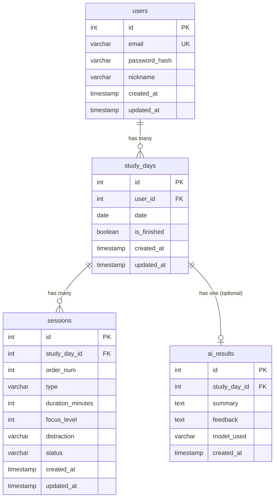

# DB 초안 — Studiary

> 버전: 0.1 (spec 초안)
> 최종 업데이트: 2026-04-11

---

## 1. ERD

---

## 2. 테이블 정의

### 2.1 users

사용자 계정 정보

| 컬럼 | 타입 | 제약조건 | 설명 |
|------|------|---------|------|
| id | SERIAL | PK | 사용자 ID |
| email | VARCHAR(255) | UNIQUE, NOT NULL | 로그인 이메일 |
| password_hash | VARCHAR(255) | NOT NULL | bcrypt 해시 비밀번호 |
| nickname | VARCHAR(50) | NOT NULL | 표시 이름 |
| created_at | TIMESTAMP | NOT NULL, DEFAULT NOW() | 가입일시 |
| updated_at | TIMESTAMP | NOT NULL, DEFAULT NOW() | 수정일시 |

### 2.2 study_days

일별 학습 기록 (하루에 하나, 사용자별)

| 컬럼 | 타입 | 제약조건 | 설명 |
|------|------|---------|------|
| id | SERIAL | PK | 학습일 ID |
| user_id | INTEGER | FK → users.id, NOT NULL | 사용자 |
| date | DATE | NOT NULL | 학습 날짜 |
| is_finished | BOOLEAN | NOT NULL, DEFAULT FALSE | 공부 종료 여부 |
| created_at | TIMESTAMP | NOT NULL, DEFAULT NOW() | 생성일시 |
| updated_at | TIMESTAMP | NOT NULL, DEFAULT NOW() | 수정일시 |

- UNIQUE 제약: `(user_id, date)` — 사용자별 날짜당 하나의 레코드

### 2.3 sessions

개별 공부/휴식 세션

| 컬럼 | 타입 | 제약조건 | 설명 |
|------|------|---------|------|
| id | SERIAL | PK | 세션 ID |
| study_day_id | INTEGER | FK → study_days.id, NOT NULL | 소속 학습일 |
| order_num | SMALLINT | NOT NULL | 세션 순서 (1부터) |
| type | VARCHAR(10) | NOT NULL, CHECK IN ('study', 'rest') | 세션 유형 |
| duration_minutes | INTEGER | NOT NULL, CHECK > 0 | 설정 시간 (분) |
| focus_level | SMALLINT | NULL, CHECK 1~5 | 집중도 (study만, rest는 NULL) |
| distraction | VARCHAR(100) | NULL | 방해요소 (study만, 100자 제한) |
| status | VARCHAR(15) | NOT NULL, DEFAULT 'running', CHECK IN ('running', 'paused', 'completed') | 세션 상태 |
| created_at | TIMESTAMP | NOT NULL, DEFAULT NOW() | 생성일시 |
| updated_at | TIMESTAMP | NOT NULL, DEFAULT NOW() | 수정일시 |

### 2.4 ai_results

AI 요약/피드백 결과 (study_day당 최대 1개)

| 컬럼 | 타입 | 제약조건 | 설명 |
|------|------|---------|------|
| id | SERIAL | PK | AI 결과 ID |
| study_day_id | INTEGER | FK → study_days.id, UNIQUE, NOT NULL | 소속 학습일 (1:1) |
| summary | TEXT | NULL | AI 생성 요약 |
| feedback | TEXT | NULL | AI 생성 피드백 |
| model_used | VARCHAR(100) | NULL | 사용된 AI 모델명 |
| created_at | TIMESTAMP | NOT NULL, DEFAULT NOW() | 생성일시 |

---

## 3. 관계 요약

| 관계 | 타입 | 설명 |
|------|------|------|
| users → study_days | 1:N | 사용자별 여러 학습일 |
| study_days → sessions | 1:N | 학습일별 여러 세션 |
| study_days → ai_results | 1:0..1 | 학습일별 AI 결과 0 또는 1개 |

---

## 4. 인덱스 전략

| 테이블 | 인덱스명 | 컬럼 | 타입 | 용도 |
|--------|---------|------|------|------|
| users | uq_users_email | email | UNIQUE | 이메일 중복 방지 + 로그인 조회 |
| study_days | uq_study_days_user_date | (user_id, date) | UNIQUE | 사용자별 날짜 유일성 보장 |
| study_days | ix_study_days_user_id | user_id | INDEX | 사용자별 학습일 조회 |
| study_days | ix_study_days_date | date | INDEX | 날짜 범위 조회 (히트맵) |
| sessions | ix_sessions_study_day_id | study_day_id | INDEX | 학습일별 세션 조회 |
| sessions | ix_sessions_order | (study_day_id, order_num) | UNIQUE | 세션 순서 유일성 |
| ai_results | uq_ai_results_study_day | study_day_id | UNIQUE | 학습일당 1개 AI 결과 |

---

## 5. 계산 필드 (API 레벨, DB 비저장)

아래 값들은 DB에 컬럼으로 저장하지 않고, API 응답 시 세션 데이터에서 실시간 계산한다.

| 필드 | 계산 방식 |
|------|----------|
| `total_study_minutes` | SUM(duration_minutes) WHERE type='study' |
| `total_rest_minutes` | SUM(duration_minutes) WHERE type='rest' |
| `avg_focus_ceil` | CEIL(AVG(focus_level)) WHERE type='study' AND focus_level IS NOT NULL |
| `has_ai_result` | ai_results 레코드 존재 여부 |

---

## 6. 마이그레이션 전략

- Alembic으로 마이그레이션 관리
- `alembic/versions/` 에 마이그레이션 파일 저장
- Docker 컨테이너 시작 시 `alembic upgrade head` 자동 실행
- 초기 마이그레이션: 4개 테이블 + 인덱스 일괄 생성

---

## 7. 데이터 무결성 규칙

1. `sessions.focus_level`과 `sessions.distraction`은 `type='study'`인 경우에만 값을 가짐 (애플리케이션 레벨 검증)
2. `study_days.is_finished = true`인 경우 해당 study_day의 세션 수정/삭제 불가 (애플리케이션 레벨 검증)
3. `ai_results`는 `study_days.is_finished = true`인 경우에만 생성 가능
4. 세션 삭제 시 order_num 재정렬 (애플리케이션 레벨)
5. `CASCADE DELETE`: study_days 삭제 시 sessions, ai_results 함께 삭제
