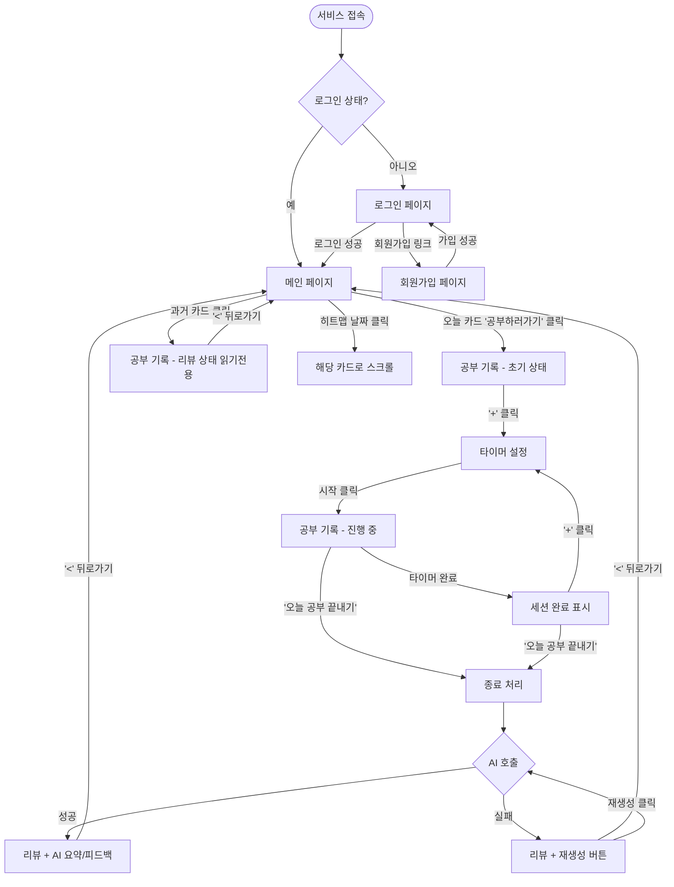
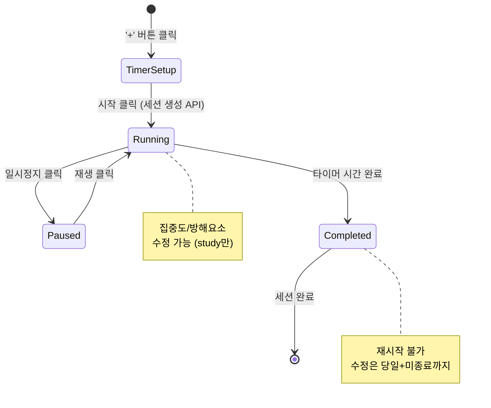
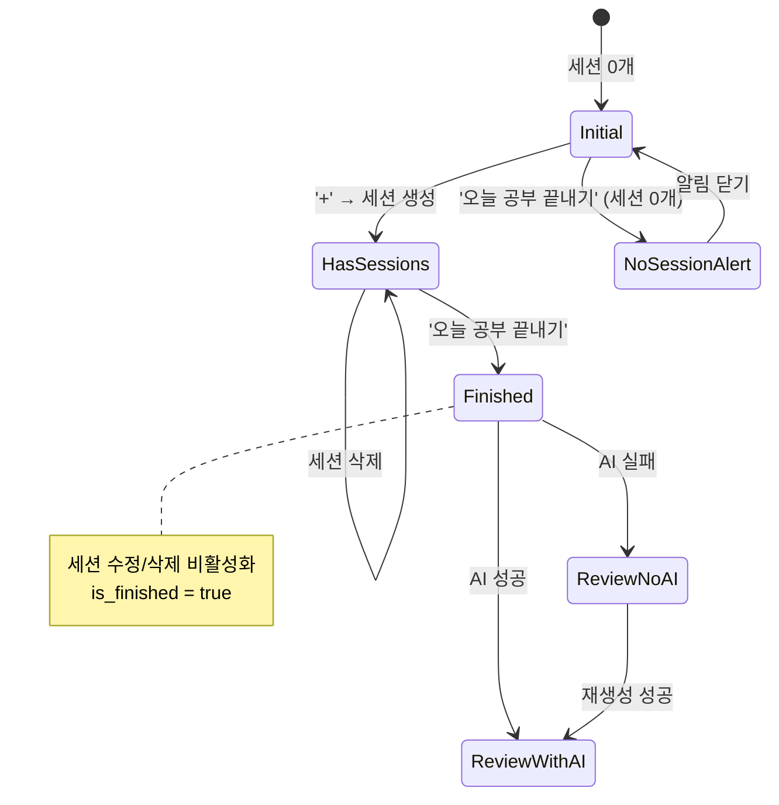

# 화면 설계 — Studiary

> 버전: 0.1 (spec 초안)
> 최종 업데이트: 2026-04-11

---

## 1. 페이지 목록

| # | 페이지 | 라우트 | 인증 | 설명 |
|---|--------|--------|------|------|
| 1 | 로그인 | `/login` | X | 이메일/비밀번호 로그인 |
| 2 | 회원가입 | `/register` | X | 이메일/비밀번호/닉네임 회원가입 |
| 3 | 메인 (기록 목록) | `/` | O | 히트맵 + 카드 목록 |
| 4 | 공부 기록 | `/study/:date` | O | 공부 시작/진행/리뷰 통합 페이지 |

---

## 2. 사용자 흐름



---

## 3. 와이어프레임

### 3.1 로그인 페이지 (`/login`)

```text
+--------------------------------------------------+
|                    Studiary                       |
+--------------------------------------------------+
|                                                  |
|              [ 이메일 입력 ]                       |
|              [ 비밀번호 입력 ]                      |
|                                                  |
|              [     로그인     ]                    |
|                                                  |
|              계정이 없으신가요? 회원가입               |
|                                                  |
+--------------------------------------------------+
```

### 3.2 회원가입 페이지 (`/register`)

```text
+--------------------------------------------------+
|                    Studiary                       |
+--------------------------------------------------+
|                                                  |
|              [ 이메일 입력 ]                       |
|              [ 비밀번호 입력 ]                      |
|              [ 비밀번호 확인 ]                      |
|              [ 닉네임 입력 ]                       |
|                                                  |
|              [    회원가입    ]                    |
|                                                  |
|              이미 계정이 있으신가요? 로그인            |
|                                                  |
+--------------------------------------------------+
```

### 3.3 메인 페이지 (`/`)

```text
+--------------------------------------------------+
|  Studiary                        [닉네임] 로그아웃  |
+--------------------------------------------------+
|  [ Study Heatmap ]                               |
|  |2026| |04|                                     |
|  [ ][ ][ ][■][■][ ][ ][ ][ ][ ][ ][ ][ ][ ]      |
|  [ ][■][■][■][ ][ ][ ][ ][ ][ ][ ][ ][ ][ ]      |
|  색상: □ 기록없음  ■ 집중도1~5(옅은초록→진한초록)      |
|                                                  |
|  ── 스크롤 영역 ──                                 |
|                                                  |
|   2026-04-09                                     |
|  +--------------------------------------------+  |
|  | 총 공부시간: 4h 30m (집중: 4h, 휴식: 30m)       |  |
|  | AI 요약: 스트레칭 후 공부 시작. 컨디션 굿.         |  |
|  | AI 피드백: 스트레칭 이후 방 환기 추가.             |  |
|  +--------------------------------------------+  |
|                                                  |
|   2026-04-10                                     |
|  +--------------------------------------------+  |
|  | 총 공부시간: 3h 15m (집중: 3h, 휴식: 15m)       |  |
|  | AI 요약: -  [AI 재생성 필요]                    |  |
|  | AI 피드백: -                                  |  |
|  +--------------------------------------------+  |
|                                                  |
|   2026-04-11 (오늘)                               |
|  +--------------------------------------------+  |
|  |               [ 공부 하러 가기 ]              |  |
|  +--------------------------------------------+  |
+--------------------------------------------------+
```

### 3.4 공부 기록 - 초기 상태 (`/study/2026-04-11`)

```text
+--------------------------------------------------+
|  [<] 2026-04-11                                  |
+--------------------------------------------------+
|                                                  |
|                       (+)                        |
|                                                  |
|                                                  |
|                                                  |
|                                                  |
|                                                  |
|                                                  |
|                                                  |
|                                                  |
|                 [ 오늘 공부 끝내기 ]                 |
+--------------------------------------------------+
```

### 3.5 공부 기록 - 타이머 설정

```text
+--------------------------------------------------+
|  [<] 2026-04-11                                  |
+--------------------------------------------------+
|                                                  |
|  +--------------------------------------------+  |
|  |                   [ ▲ ]                    |  |
|  |                   50:00                    |  |
|  |                   [ ▼ ]                    |  |
|  |                                            |  |
|  |                  [ 시작 ]                   |  |
|  +--------------------------------------------+  |
|                                                  |
|                                                  |
|                                                  |
|                 [ 오늘 공부 끝내기 ]                 |
+--------------------------------------------------+
```

### 3.6 공부 기록 - 진행 중 (`/study/2026-04-11`)

```text
+--------------------------------------------------+
|  [<] 2026-04-11                                  |
+--------------------------------------------------+
|                                                  |
|  [ 세션 1 ]                                       |
|  +---------+                                [⋮]  |
|  |         |  집중도: (●)(●)(●)( )( )              |
|  |  45:59  |  방해요소:                            |
|  | ( ⏸ )  |  +---------------------------------+|
|  |         |  | 친구랑 싸워서 신경쓰임               ||
|  +---------+  +-------------------------(18/100)+|
|                                                  |
|                      (+)                         |
|                                                  |
|                                                  |
|                 [ 오늘 공부 끝내기 ]                 |
+--------------------------------------------------+

세션 유형 시각 구분:
  +---------+       ╭─────────╮
  | 공부     |       │ 휴식     │
  | (사각형) |       │ (원형)   │
  +---------+       ╰─────────╯
```

### 3.7 공부 기록 - 리뷰 (`/study/2026-04-11`)

```text
+--------------------------------------------------+
|  [<] 2026-04-11 (오늘 공부 리뷰)                    |
+--------------------------------------------------+
|                                                  |
|  [ 세션 1 ]                                       |
|  +---------+                                      |
|  |  study  |  집중도: (●)(●)(●)( )( )              |
|  |  50min  |  방해요소: 친구랑 싸워서 신경쓰임          |
|  +---------+                                      |
|                                                  |
|     ╭─────────╮                                   |
|     │  rest   │                                   |
|     │  10min  │                                   |
|     ╰─────────╯                                   |
|                                                  |
|  [ 세션 3 ]                                       |
|  +---------+                                      |
|  |  study  |  집중도: (●)(●)(●)(●)(●)              |
|  |  50min  |  방해요소: 없음                        |
|  +---------+                                      |
+--------------------------------------------------+
|                                                  |
|  [ 집중도 변화 그래프 ]                               |
|   5 |               ●                            |
|   4 |                                            |
|   3 | ●                                          |
|   2 |                                            |
|   1 |                                            |
|     +------------------                          |
|       1         3  (세션 번호, study만)             |
|                                                  |
|  [ AI 한 줄 요약 ]                                 |
|  공부 전 명상. 간식과 함께 공부 시작. 후반부             |
|  집중력이 돋보였습니다.                               |
|                                                  |
|  [ AI 한 줄 피드백 ]                                |
|  방해요소를 잘 인지하고 극복했습니다. 다음엔 휴식 시간을     |
|  조금 늘려보는 것도 좋겠습니다.                        |
|                                                  |
+--------------------------------------------------+
```

---

## 4. 세션 상태 다이어그램



---

## 5. 공부 기록 페이지 상태 다이어그램



---

## 6. 히트맵 상세

### 6.1 색상 매핑

| 집중도 평균 올림값 | 색상 | CSS 예시 |
|------------------|------|---------|
| 기록 없음 / 0 | 갈색 | `#d2b48c` |
| 1 | 가장 옅은 초록 | `#c6e48b` |
| 2 | 옅은 초록 | `#7bc96f` |
| 3 | 중간 초록 | `#449945` |
| 4 | 진한 초록 | `#2d6a30` |
| 5 | 가장 진한 초록 | `#196127` |

### 6.2 히트맵 인터랙션

- 월 선택기: 년도/월 변경 시 해당 월 데이터 로드
- 날짜 셀 클릭: 해당 날짜의 Recorded Study Card로 부드러운 스크롤
- 각 셀은 해당 월의 날짜 그리드 (7열 x N행, 일~토)

---

## 7. 반응형 기준

| 브레이크포인트 | 설명 |
|-------------|------|
| ~640px | 모바일 (히트맵 축소, 카드 풀 와이드) |
| 641~1024px | 태블릿 |
| 1025px~ | 데스크톱 (최대 너비 제한) |
