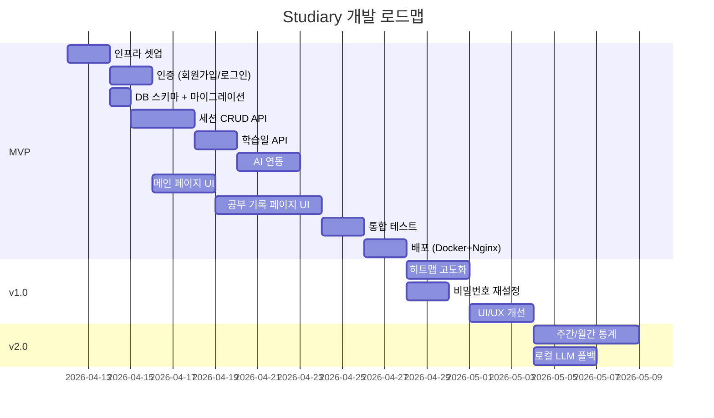

# 마일스톤 — Studiary

> 버전: 0.1 (spec 초안)
> 최종 업데이트: 2026-04-11

---

## 1. 전체 로드맵

---

## 2. MVP (Phase 1) 상세

### 목표
모든 P0 기능이 실제 배포 환경에서 동작하는 최소 제품

### 작업 목록

| # | 작업 | 담당 | 산출물 | 완료 기준 |
|---|------|------|--------|----------|
| M-1 | 프로젝트 초기 셋업 | DevOps | Docker Compose, Nginx 설정, .env.example | 로컬에서 compose up으로 전체 스택 기동 |
| M-2 | DB 스키마 생성 | Backend | Alembic 마이그레이션 파일 | 4개 테이블 + 인덱스 생성 완료 |
| M-3 | 회원가입/로그인 API | Backend | auth 라우터 | 회원가입 → 로그인 → JWT 발급 동작 |
| M-4 | 인증 미들웨어 | Backend | dependencies.py | JWT 검증, 401/403 정상 반환 |
| M-5 | 세션 CRUD API | Backend | sessions 라우터 | 생성/수정/삭제, 타입 자동결정, 당일 제한 동작 |
| M-6 | 학습일 API | Backend | study_days 라우터 | 월별 목록, 상세 조회, 종료 처리 동작 |
| M-7 | 히트맵 API | Backend | heatmap 라우터 | 월별 날짜별 집중도 올림값 반환 |
| M-8 | AI 연동 | Backend | ai_service, ai_client | OpenRouter 3모델 fallback, 요약→피드백 순차 호출 |
| M-9 | AI 재생성 API | Backend | study_days 라우터 | 기존 AI 없을 때만 재생성 허용 |
| M-10 | 로그인/회원가입 UI | Frontend | LoginPage, RegisterPage | 폼 입력 → API 호출 → 토큰 저장 → 리다이렉트 |
| M-11 | 메인 페이지 UI | Frontend | MainPage, Heatmap, StudyCard | 히트맵 표시, 카드 목록, 스크롤 연동 |
| M-12 | 공부 기록 페이지 UI | Frontend | StudyPage (초기/진행/리뷰) | 세션 추가, 타이머, 집중도/방해요소 입력, 종료 흐름 |
| M-13 | 타이머 구현 | Frontend | timer 유틸, TimerDisplay | 카운트다운, 일시정지/재생, 완료 감지 |
| M-14 | AI 리뷰 UI | Frontend | FocusChart, AISummary, AIFeedback | 집중도 그래프, AI 텍스트 표시, 재생성 버튼 |
| M-15 | 배포 | DevOps | OCI 서버 배포 | Cloudflare HTTPS → Nginx → 서비스 정상 접속 |

### MVP 수락 기준

1. 회원가입 → 로그인 → 메인 → 공부 시작 → 세션 기록 → 종료 → AI 리뷰 전체 흐름 동작
2. AI 실패 시 기록 보존 + 재생성 가능
3. 과거 기록 열람 가능
4. HTTPS로 실서비스 접속 가능

---

## 3. v1.0 (Phase 2)

### 목표
MVP 사용성 개선 + 누락 기능 보완

| # | 작업 | 설명 |
|---|------|------|
| V1-1 | 히트맵 인터랙션 고도화 | 호버 시 날짜/집중도 툴팁, 애니메이션 |
| V1-2 | 비밀번호 재설정 | 이메일 발송 기반 비밀번호 재설정 |
| V1-3 | UI/UX 개선 | 반응형 모바일 최적화, 로딩 스켈레톤, 에러 토스트 |
| V1-4 | 타이머 UX 개선 | 브라우저 탭 비활성 시에도 정확한 타이머, 알림음 |
| V1-5 | 에러 처리 고도화 | 네트워크 오류 재시도, 오프라인 감지 |

---

## 4. v2.0 (Phase 3)

### 목표
데이터 기반 인사이트 + 안정성 강화

| # | 작업 | 설명 |
|---|------|------|
| V2-1 | 주간/월간 통계 | 학습 시간 추이, 집중도 평균 변화, 자주 나오는 방해요소 |
| V2-2 | 로컬 LLM 폴백 | Docker ollama 연동, OpenRouter 장애 시 자동 전환 |
| V2-3 | 소셜 로그인 | Google OAuth 연동 |
| V2-4 | 학습 목표 | 일일/주간 목표 시간 설정, 달성률 표시 |
| V2-5 | PWA 지원 | 모바일 홈스크린 추가, 오프라인 기본 캐시 |

---

## 5. 기술 부채 (Tech Debt)

| # | 항목 | 우선순위 | 시점 |
|---|------|---------|------|
| TD-1 | 타이머 정확도 | 높음 | MVP 이후 즉시 |
| TD-2 | API 응답 캐싱 | 중간 | v1.0 |
| TD-3 | 프론트엔드 테스트 | 중간 | v1.0 |
| TD-4 | 백엔드 단위 테스트 | 중간 | v1.0 |
| TD-5 | DB 쿼리 최적화 | 낮음 | v2.0 (사용자 증가 시) |
| TD-6 | 로깅/모니터링 | 낮음 | v2.0 |
| TD-7 | Rate Limiting | 낮음 | v2.0 |

---

## 6. 리스크 및 대응

| 리스크 | 영향 | 대응 |
|--------|------|------|
| OpenRouter 무료 모델 불안정 | AI 기능 불가 | 3모델 fallback + 재생성 버튼 + 로컬 LLM 대비 |
| OCI 서버 리소스 부족 | 서비스 중단 | Docker 리소스 제한 설정, PostgreSQL 커넥션 풀 |
| 타이머 브라우저 비활성 시 부정확 | UX 저하 | Web Worker 또는 서버 타임스탬프 보정 |
| JWT 토큰 만료 처리 | 사용자 세션 끊김 | Refresh Token 패턴 (v1.0에서 도입) |
