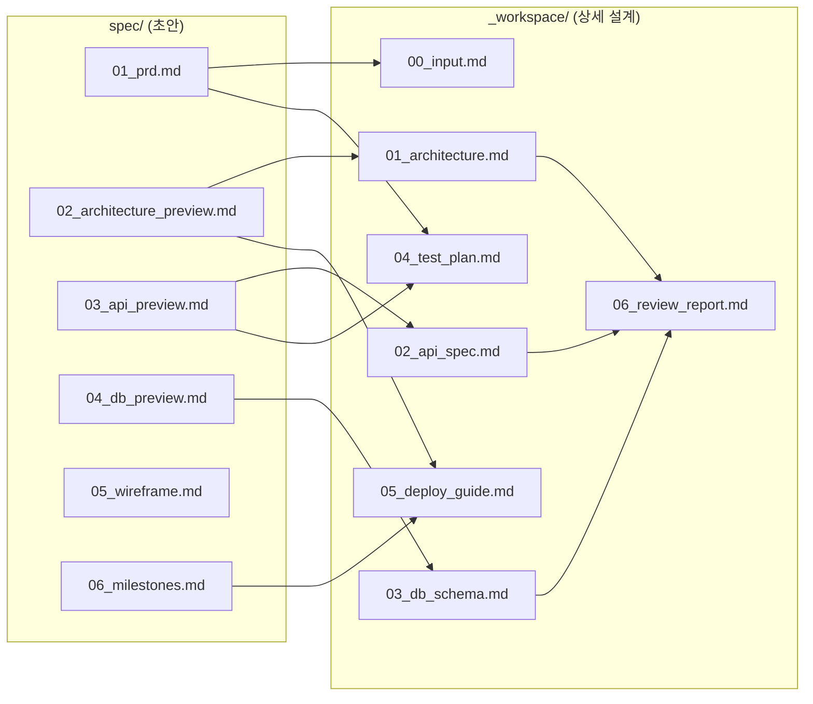

# spec/ 인덱스 — Studiary

> 버전: 0.1
> 최종 업데이트: 2026-04-11

---

## 1. spec/ 문서 목록

| 파일 | 내용 | 주요 소비자 |
|------|------|-----------|
| `01_prd.md` | 제품 요구사항 (기능/비기능/사용자 여정) | 전체 에이전트 |
| `02_architecture_preview.md` | 기술 스택, 시스템 구성도, 디렉토리 구조 | architect, devops |
| `03_api_preview.md` | API 엔드포인트 상세, 인증, AI 호출 | backend-dev, frontend-dev |
| `04_db_preview.md` | ERD, 테이블 정의, 인덱스 전략 | backend-dev |
| `05_wireframe.md` | 페이지 목록, 와이어프레임, 상태 다이어그램 | frontend-dev |
| `06_milestones.md` | 로드맵, MVP 작업 목록, 리스크 | 전체 에이전트 |

---

## 2. spec/ → _workspace/ 매핑

### 매핑 상세

| spec/ 문서 | _workspace/ 문서 | 관계 |
|-----------|-----------------|------|
| `01_prd.md` | `00_input.md` | PRD가 입력 문서의 핵심 소스 |
| `02_architecture_preview.md` | `01_architecture.md` | 초안 → 상세 아키텍처 확정 |
| `03_api_preview.md` | `02_api_spec.md` | 초안 → 상세 API 명세 확정 |
| `04_db_preview.md` | `03_db_schema.md` | 초안 → 상세 DB 스키마 확정 |
| `01_prd.md` + `03_api_preview.md` | `04_test_plan.md` | 요구사항 + API에서 테스트 케이스 도출 |
| `02_architecture_preview.md` + `06_milestones.md` | `05_deploy_guide.md` | 인프라 + 마일스톤에서 배포 가이드 도출 |
| 전체 _workspace/ | `06_review_report.md` | QA 리뷰 대상 |

---

## 3. 에이전트 프로토콜

| 에이전트 | 읽어야 할 spec/ | 생성하는 _workspace/ |
|---------|---------------|-------------------|
| architect | 전체 spec/ | 00, 01, 02, 03 |
| frontend-dev | 01, 02, 03, 05 | src/frontend |
| backend-dev | 01, 02, 03, 04 | src/backend |
| qa-engineer | 01, 03 | 04 |
| devops-engineer | 02, 06 | 05 |

---

## 4. 프로모션 규칙 (spec/ → _workspace/)

1. `/fullstack-webapp` 호출 시 architect가 spec/ 전체를 검증한다
2. spec/이 충분하면 _workspace/를 생성한다 (spec/ 내용을 상세화)
3. spec/이 부족하면 spec/을 먼저 보강하고, 사용자에게 재호출을 요청한다
4. _workspace/ 생성 후에는 spec/을 수정하지 않는다 (변경 사항은 _workspace/에 반영)
5. spec/은 "초안", _workspace/는 "확정 설계"로 취급한다

---

## 5. 현재 상태

- [x] `idea.md` 작성 완료
- [x] `idea_inquiry.md` 작성 완료 (의사결정 포인트 확정)
- [x] `spec/` 초안 생성 완료
- [ ] `_workspace/` 상세 설계 (대기 중)
- [ ] `src/` 구현 (대기 중)
